# 🏫 IS216 Web Application Development II

---

## G4 Group 20

---

## Group Members

| Photo | Full Name | Role / Features Responsible For |
|:--:|:--|:--|
|  | ChatGPT + Claude | Our Bestfriend |
|  | Joshua Lim | Supreme Leader - Oversees project direction, architecture, and integration of the Profile and Dashboard features. |
|  | Jared Chan | Lead Backend Engineer - Develops and maintains backend logic for Auction Theatre and Management systems. |
|  | Javen Tan | UI/UX Designer - Designs user flows and interfaces for the Landing and Category pages, ensuring visual consistency and usability. |
|  | Kai Wen | Frontend Developer - Builds and refines the Auction Creation interface with responsive, user-friendly design. |
|  | Benedic Tan | Backend Engineer - Implements APIs and database logic for the Auction Creation module. |
|  | Jacob Soh | System Architect - Designs core system architecture, ensures seamless integration between frontend and backend, and maintains codebase scalability. |

> Place all headshot thumbnails in the `/photos` folder (JPEG or PNG).

---

## Business Problem

Singapore’s e-commerce scene has seen growing interest in live auctions, but the lack of dedicated platforms has driven sellers to use social media channels like Telegram, TikTok Live, and Instagram Live. These platforms are not optimized for auctions—bids are sent through chat messages, creating clutter and confusion, while payment processes remain unsecured, raising scam risks.

Our project addresses these gaps by creating a dedicated online auction platform that provides a secure, intuitive, and engaging space for users to trade safely.

> Auctions on social media are scattered and hard to access.
> Payments are manual and lack seller verification.
> Scam cases from unverified sales are increasing.

---

## Web Solution Overview

### 🎯 Intended Users
Young Adults around 21 - 35 years old, Mixed of Genders, 
looking for second hand items or exquisite collections.

### 💡 What Users Can Do & Benefits

Explain the core features and the benefit each provides.  

| Feature | Description | User Benefit |
|:--|:--|:--|
| Register & Login | Secure authentication system for all users | Provides personalized access and protects user data |
| Categorization and Featured Auctions | Browse items by category or view trending auctions | Saves time and helps users discover relevant listings easily |
| 3D Auction House | Immersive 3D environment for live auctions | Creates an engaging, interactive experience for younger audiences |
| Digital Wallet (Hitpay) | Enables seamless and secure in-app payments | Removes the need for manual transfers and payment screenshots |
| Identity Verification (Persona) | Verifies users through official ID checks | Ensures seller authenticity and builds trust across the platform |

---

## Tech Stack

| Logo | Technology | Purpose / Usage |
|:--:|:--|:--|
|  | **HTML5** | Structure and layout |
|  | **CSS3 / Tailwind** | Styling and responsiveness |
|  | **ShadCN** | React component library |
|  | **JavaScript (ES6)** |  Interactivity and logic |
|  | **Next JS / React JS** | Frontend and routing framework |

---

## Use Case & User Journey

### Buyer Journey

1. **Landing Page & Navigation**
   

   - Users are greeted with the landing page showcasing "Vintage Retro Finds" with a discover button to explore the platform.

   

   - Navigation menu provides easy access to Home, Auctions, Categories, Profile, and Dashboard.

2. **User Registration**
   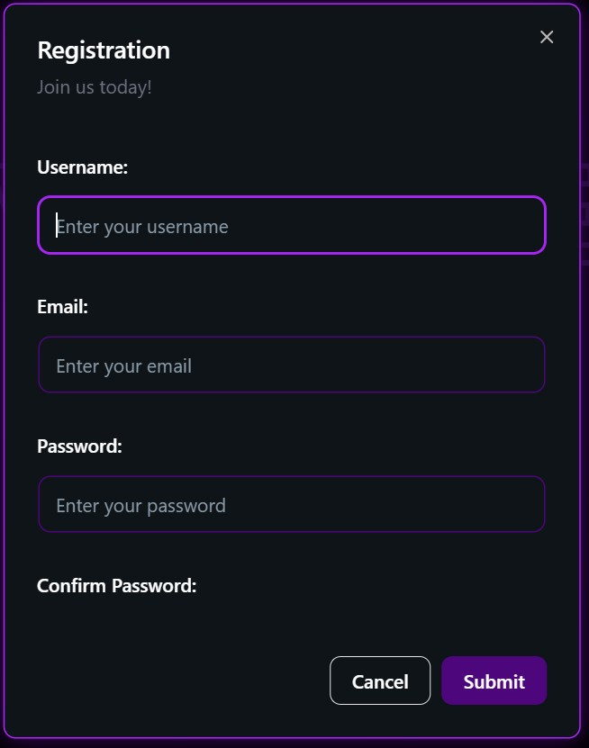

   - New users sign up by providing their username, email, and password to create an account.

3. **User Login**
   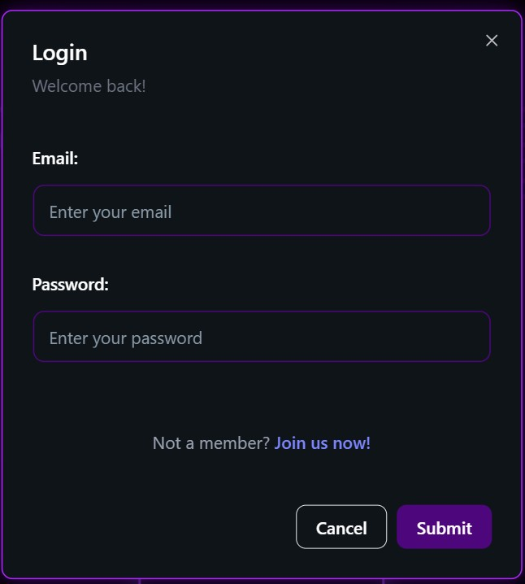

   - Returning users authenticate with their credentials to access personalized features.

4. **Wallet Top-Up & Payment Flow**
   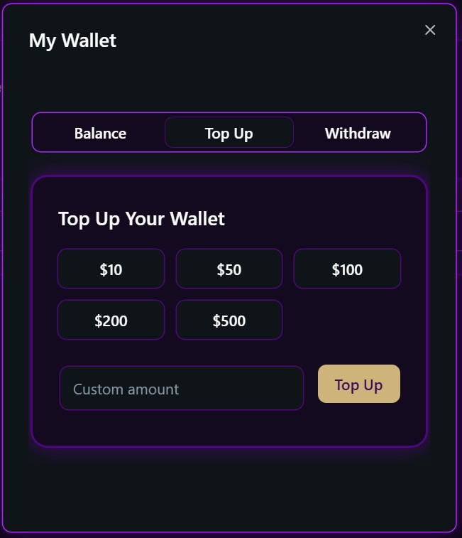

   - Users add funds to their wallet by selecting preset amounts or entering a custom value.

   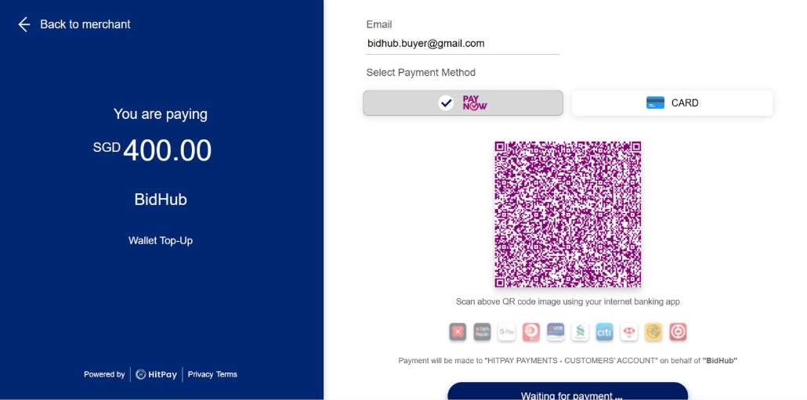

   - Payment gateway (HitPay) integration displays the amount and payment method selection.

   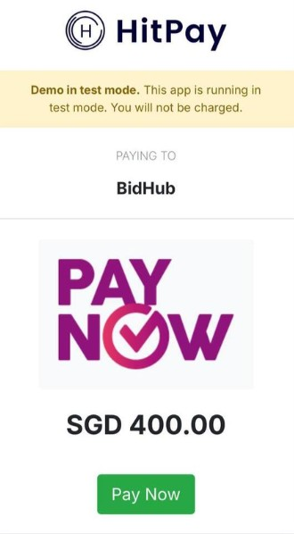

   - Users complete the transaction via PayNow or other supported payment methods.

   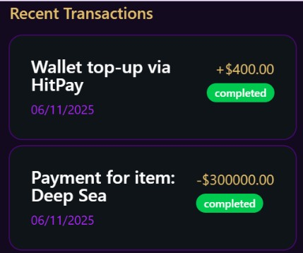

   - Transaction history shows completed wallet top-ups and auction payments.

5. **Browse Categories**
   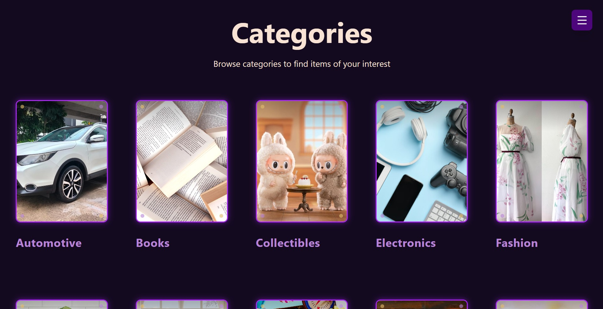

   - Users explore diverse categories including Automotive, Books, Collectibles, Electronics, and Fashion to discover items of interest.

6. **Featured Auctions**
   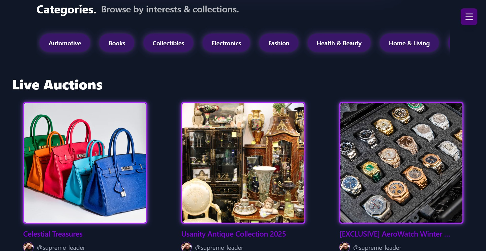

   - Live auctions are prominently displayed, showcasing featured collections with category filters for easy browsing.

7. **Live Auction House (3D Experience)**
   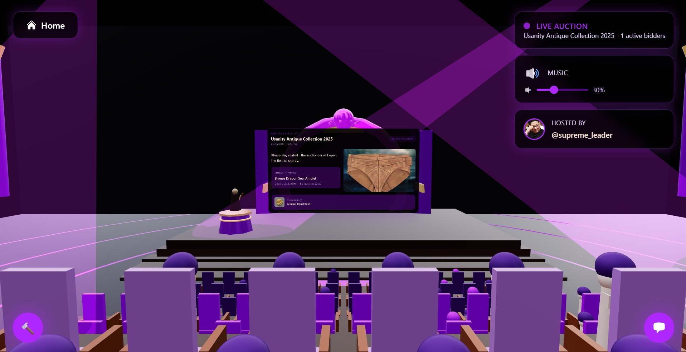

   - Immersive 3D auction environment where users can view live auctions, see active bidders, and control audio settings.

   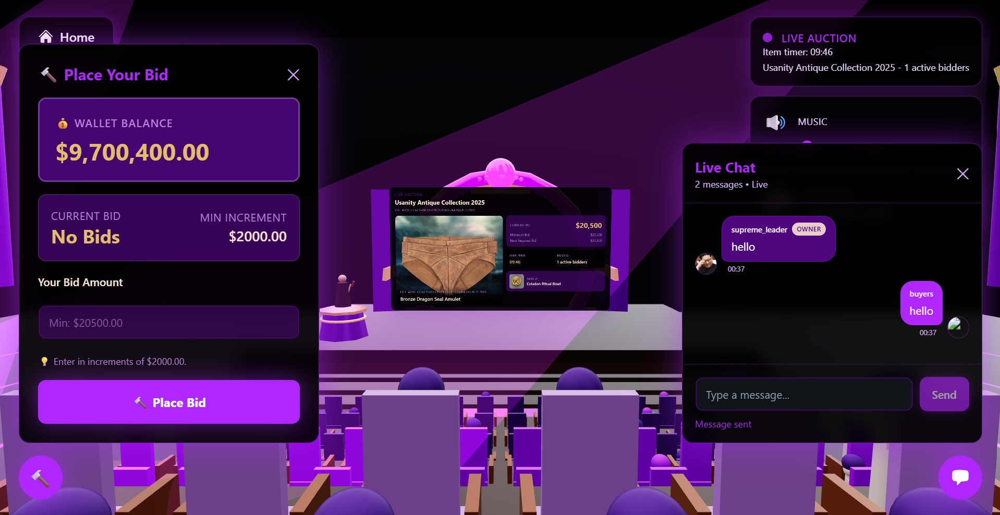

   - Interactive bidding modal displays wallet balance, current bid status, minimum increment, and live chat functionality.

8. **User Profile - Items Won**
   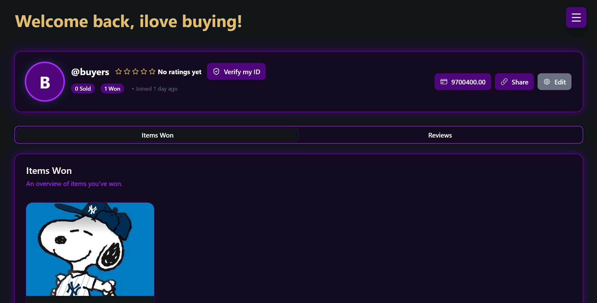

   - Buyers can view their profile showing items won, wallet balance, and verification status.

---

### Seller Journey

*After experiencing the platform as a buyer, users may want to sell their own items (or they might just want to sell items from the start). Here's how they can transition to becoming a seller:*

9. **Identity Verification**
   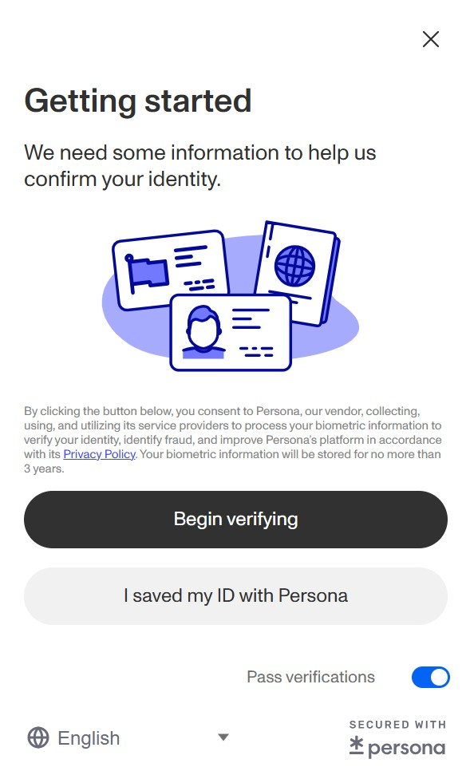

   - Users complete identity verification via Persona to become verified sellers and build trust with buyers.

10. **Seller Dashboard**
    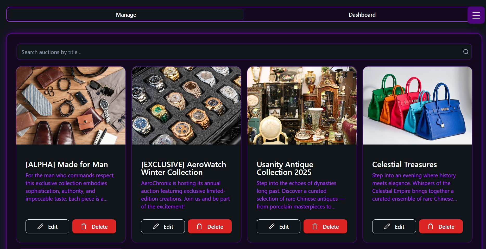

    - Verified sellers access their dashboard to view and manage all their auction listings with search functionality.

11. **Create New Auction**
    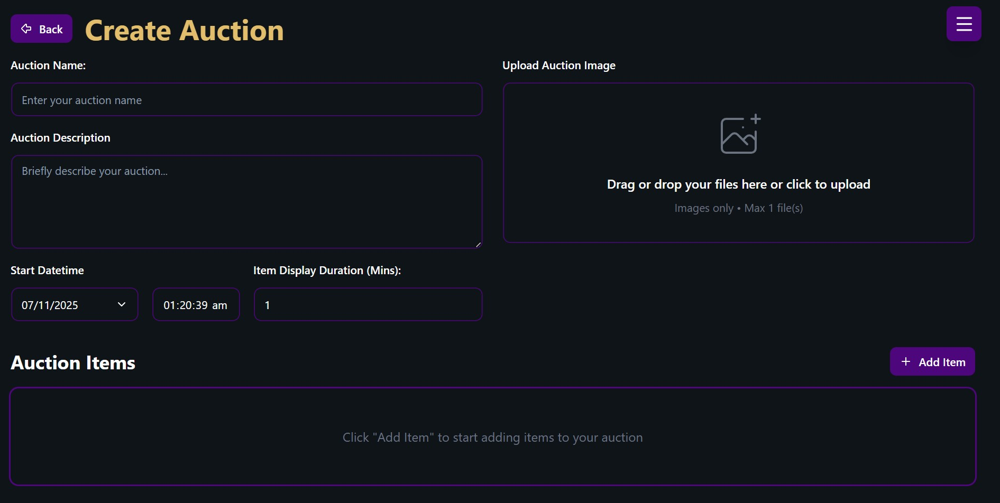

    - Sellers create auctions by providing auction name, description, images, start datetime, and item display duration.

12. **Manage Live Auctions**
    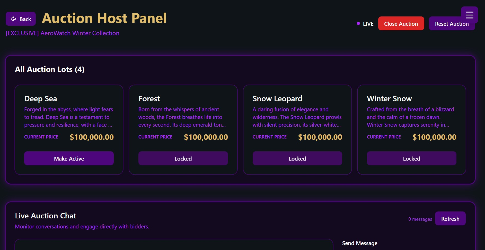

    - Auction Host Panel allows sellers to monitor all auction lots, control item display (make active/locked), manage live chat, and control auction flow.

13. **Seller Reviews**
    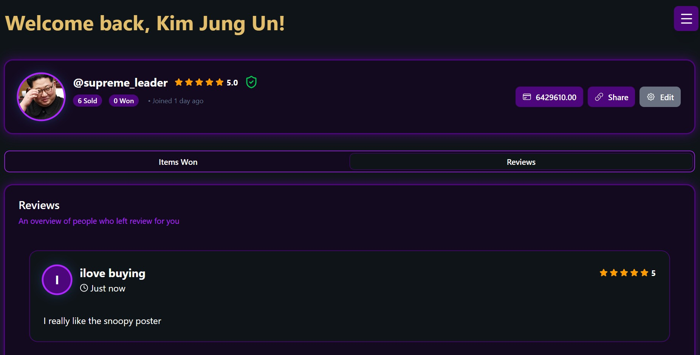

    - Sellers can view their ratings and reviews from buyers, building their reputation and credibility on the platform.

---

## Developers Setup Guide

Comprehensive steps to help other developers or evaluators run and test your project.

---

### 0) Prerequisites
- [Git](https://git-scm.com/) v2.4+  
- [Node.js](https://nodejs.org/) v18+ and npm v9+  
- Access to backend or cloud services used (Firebase, MongoDB Atlas, AWS S3, etc.)

---

### 1) Download the Project
```bash
git clone https://github.com/JacobSoh/IS216_G4_T20.git
cd IS216_G4_T20
npm install
```

---

### 2) Configure Environment Variables
Create a `.env.local` file in the root directory with the following structure:

```bash
# Replace BASE_URL with Ngrok's if Ngrok's is used.
NEXT_PUBLIC_BASE_URL=
NEXT_PUBLIC_API_BASE_URL=

# Supabase API Keys
NEXT_PUBLIC_SUPABASE_URL=
NEXT_PUBLIC_SUPABASE_ANON_KEY=
SUPABASE_SECRET_KEY=

# HitPay SANDBOX/TEST Configuration
# Uses webhook, require special configuration at HitPay Dashboard
HITPAY_API_KEY=
HITPAY_SALT=
HITPAY_API_URL=

# Persona API
# Uses webhook, require special configuration at Persona Dashboard
NEXT_PUBLIC_PERSONA_TEMPLATE_ID=
NEXT_PUBLIC_PERSONA_ENV_ID=
PERSONA_API_KEY=
PERSONA_WEBHOOK_SECRET=

# Google API Key
NEXT_PUBLIC_GOOGLE_MAPS_BROWSER_KEY=

# SerpAPI Key
NEXT_PUBLIC_SERPAPI_KEY=
```

---

### 3) Backend / Cloud Service Setup

#### NGROK
1. Go to [Ngrok](https://dashboard.ngrok.com/signup)
2. Sign up for an account
3. Copy and run ngrok command
   - ```
      ngrok config add-authtoken <AUTH TOKEN>
      ngrok http 3000
      ```
4. Copy the Ngrok HTTPS Url into `.env.local` file.

#### Supabase
1. Go to [Supabase](https://supabase.com/dashboard/org)
2. Create a new project.
3. Enable the following:
   - **Authentication** → Email/Password sign-in
   - **Create Scehmas** -> Load [main.sql](README/main.sql)
4. Copy the Supabase required API into your `.env.local` file.

### HitPay & Persona
1. Inform contributors if testing these APIs

---

### 4) Run the Frontend
To start the development server:
```bash
npm run dev
```
The project will run on [http://localhost:3000](http://localhost:3000) by default.

To build and preview the production version:
```bash
npm run build
npm run preview
```

---

### 5) Testing the Application

#### Manual Testing
Perform the following checks before submission:

| Area | Test Description | Expected Outcome |
|:--|:--|:--|
| Authentication | Register, Login, Logout | User successfully signs in/out |
| CRUD Operations | Add, Edit, Delete data | Database updates correctly |
| Responsiveness | Test on mobile & desktop | Layout adjusts without distortion |
| Navigation | All menu links functional | Pages route correctly |
| Error Handling | Invalid inputs or missing data | User-friendly error messages displayed |

#### Automated Testing (Optional)
If applicable:
```bash
npm run test
```

---

### 6) Common Issues & Fixes

| Issue | Cause | Fix |
|:--|:--|:--|
| `Module not found` | Missing dependencies | Run `npm install` again |
| `Firebase: permission-denied` | Firestore security rules not set | Check rules under Firestore → Rules |
| `CORS policy error` | Backend not allowing requests | Enable your domain in CORS settings |
| `.env` variables undefined | Missing `VITE_` prefix | Rename variables to start with `VITE_` |
| `npm run dev` fails | Node version mismatch | Check Node version (`node -v` ≥ 18) |

---

## Group Reflection

Each member should contribute 2–3 sentences on their learning and project experience.

> **Example Template:**  
> - *Alice:* Learned to build reusable Vue components and manage state effectively.  
> - *Ben:* Gained experience connecting frontend and backend APIs.  
> - *Chloe:* Improved UI/UX design workflow and collaboration using Figma.  
> - *David:* Understood how Firebase Authentication and Firestore integrate with modern SPAs.  

As a team, reflect on:
- Key takeaways from working with real-world frameworks  
- Challenges faced and how they were resolved  
- Insights on teamwork, project management, and problem-solving  
